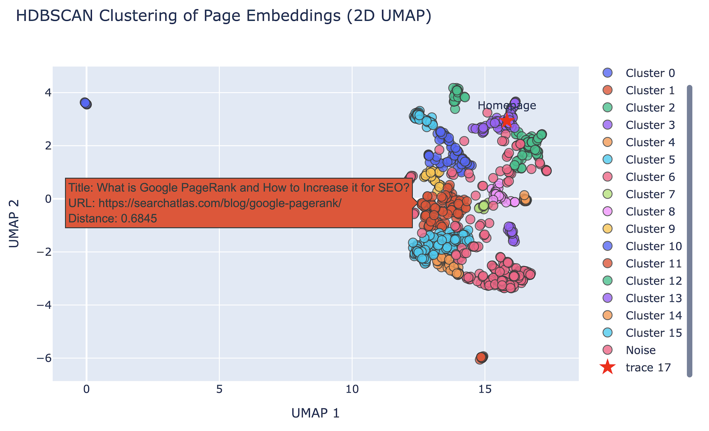

# Content Pruning by Semantic Distance

# This notebook clusters website pages based on semantic similarity using:

- Sentence Transformers
- UMAP for dimensionality reduction
- HDBSCAN for clustering

### Input

- `urls.csv`: A CSV file with a column `URL` containing all the URLs to analyze

### Output

- `semantic_clusters.csv`: Contains each URL, title, semantic distance from homepage, and cluster label
- 2D and 3D interactive visualizations of the clusters

### How to Run
1. Install dependencies (first cell)
2. Place your `urls.csv` in the same directory
3. Run all cells
